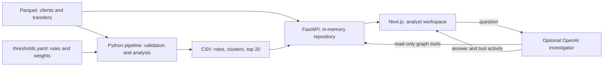

# MoneyGraph — follow the money

[Русский](README.md) · [Қазақша](README.kk.md) · **English**

Explainable money-transfer analysis for HackAlem. MoneyGraph helps financial monitoring and AML analysts decide **which clients to review first and which observed connections justify that review**.

Instead of manually inspecting thousands of transfers, analysts get a priority queue, graph roles, communities, and numeric explanations. Results are investigation hypotheses, not findings of guilt.

## Implemented features

- Loading and validation of three Parquet inputs: clients, aggregated edges, and transactions.
- A directed money graph with turnover, connectivity, retained funds, fast forwarding, PageRank, betweenness, and connections to initial clients (`seed`).
- One explainable role per client, Louvain communities, and review priority scores.
- Three CSV outputs: all client roles, cluster summaries, and a top-20 queue.
- A web workspace with priorities, exact-GID search, an interactive neighborhood graph, navigation through adjacent nodes, explanations, and cluster context.
- Warnings about the graph traversal boundary and incomplete seed inflows.
- An optional AI investigator with natural-language questions, graph analysis tools, and a tool activity log.
- Russian, Kazakh, and English UI switching. Suggested questions and AI instructions follow the selected language; the assistant is instructed to answer in that language.

### Roles and priority

Rules are evaluated in the order below; the first match determines the role. Exact thresholds are in [config/thresholds.yaml](config/thresholds.yaml), with implementation in [backend/app/analysis](backend/app/analysis).

| Role | Main signal |
|---|---|
| `coordinator` | Non-seeds must have both incoming and outgoing links, plus either at least 3 senders and 3 recipients, or total degree ≥ 8 and structural score ≥ 0.90. Seeds require at least 8 recipients and structural score ≥ 0.90. |
| `distributor` | At least 5 distinct recipients where outgoing activity is observable. |
| `consolidator` | Non-seeds: at least 3 senders, at most 2 recipients, and incoming value ≥ 100,000 KZT. |
| `transit` | Non-seeds with incoming and outgoing links: outgoing/incoming ratio 0.50–1.50, with fast-forward ratio ≥ 0.50 over a 0–2 day window. |
| `terminal` | Non-seeds outside the observation boundary: incoming and retained value ≥ 100,000 KZT, retained share ≥ 0.80, and at most 1 recipient. |
| `peripheral` | Remaining nodes; every depth-4 node receives this role with a boundary warning. |

The `priority_score` combines role strength **25%**, money significance **27%**, structural importance **15%**, seed connectivity **17%**, and anomaly evidence **16%**. Structural importance combines percentile scores for PageRank, betweenness, and degree. Anomaly signals use fast forwarding, flow imbalance, and transaction count.

`role_score` and `priority_score` range from 0 to 1 and **are not probabilities of wrongdoing**. Each `evidence` string summarizes observed metrics in fewer than 200 characters.

## How it works

1. The organizer supplies anonymized Parquet files containing client GIDs and transfers.
2. The analysis pipeline validates consistency, computes features, roles, clusters, and priorities, then writes CSV findings.
3. The backend loads inputs and findings, checks them against the current rules, and exposes an API.
4. An analyst selects a client from the queue and reviews priority explanations, transfer directions, neighbors, and cluster context. Exact-GID search also opens clients outside the top 20.
5. With OpenAI configured, the analyst can ask a follow-up question. The assistant queries graph tools and provides an explanation. A person decides what to investigate next.

## Technologies

| Layer | Stack |
|---|---|
| Analysis | Python, pandas, NumPy, PyArrow, NetworkX, SciPy, PyYAML |
| Backend | FastAPI, Uvicorn, Pydantic, python-dotenv |
| Frontend | TypeScript, Next.js 15, React 19, Cytoscape.js |
| Data | Parquet inputs, CSV outputs, an in-memory data repository |
| Optional AI | OpenAI Python SDK, Responses API; default model `gpt-4.1-mini`, configurable through `OPENAI_MODEL` |

Roles, clusters, and scores use algorithms and rules, not an LLM. No custom trained ML model is used. Dependencies are listed in [backend/requirements.txt](backend/requirements.txt) and [frontend/package.json](frontend/package.json); the frontend includes a lockfile.

## Architecture



The backend performs expensive calculations when checking findings at startup, then serves requests from a cached repository. The browser receives a bounded neighborhood rather than the entire graph. GIDs are strings to preserve long identifier precision in JavaScript.

```text
backend/pipeline.py     analysis entry point and CSV validation
backend/app/analysis/  features, roles, clusters, ranking, evidence
backend/app/api/       data repository, schemas, HTTP routes
backend/app/agent/     AI investigator and graph tools
frontend/             Next.js interface
config/thresholds.yaml rules and weights
data/                 input Parquet files
output/               CSV findings
starter/starter.py    organizer loader and graph builder
docs/architecture.md  detailed architecture
```

API: `GET /health`, `GET /api/summary`, `GET /api/priorities`, `GET /api/nodes/{gid}`, `GET /api/nodes/{gid}/graph`, `GET /api/clusters`, `GET /api/clusters/{cluster_id}`, `POST /api/investigator`. Analysis operations are read-only; POST does not modify source data.

Detailed documentation: [architecture](docs/architecture.en.md) · [interface and AI localization](docs/frontend-localization.en.md).

## Installation and startup

You need Python, Node.js with npm, and Git to obtain the repository. Local analysis was verified with Python 3.14.3; the installed Node.js version is 24.21.0. Run the commands **from the repository root**, containing `backend/`, `frontend/`, and `data/`. Input data is included. Internet access is needed to install dependencies and optionally call OpenAI.

### Windows PowerShell

1. Install dependencies:

```powershell
python -m venv .venv
.\.venv\Scripts\python.exe -m pip install -r backend\requirements.txt
Set-Location frontend
npm.cmd ci
Set-Location ..
```

If `python` is unavailable but Python Launcher is installed, use `py -m venv .venv` for the first command. Environment activation is not required.

2. Generate findings and start the backend:

```powershell
.\.venv\Scripts\python.exe backend\pipeline.py
.\.venv\Scripts\python.exe -m uvicorn backend.app.main:app --reload
```

3. In a **separate terminal**, also starting at the repository root, run the frontend:

```powershell
Set-Location frontend
npm.cmd run dev
```

### Linux / macOS

1. Install dependencies and generate findings:

```bash
python3 -m venv .venv
.venv/bin/python -m pip install -r backend/requirements.txt
cd frontend
npm ci
cd ..
.venv/bin/python backend/pipeline.py
```

2. Start the backend:

```bash
.venv/bin/python -m uvicorn backend.app.main:app --reload
```

3. In a separate terminal at the repository root, start the frontend:

```bash
cd frontend
npm run dev
```

After installing dependencies, GNU Make users can run `make analyze`, `make backend`, and `make frontend` on Windows or Linux/macOS. The Makefile selects the Python path for the OS. Without Make, use the explicit commands above.

Open the [workspace](http://localhost:3000), [Swagger API](http://127.0.0.1:8000/docs), or [backend health check](http://127.0.0.1:8000/health). Wait for Uvicorn to report successful application startup. Stop each server with `Ctrl+C`.

### API and AI configuration

Regular startup needs no `.env` file or API key. The frontend defaults to `http://localhost:8000`.

For AI, create a `.env` file **at the repository root** with your own key:

```dotenv
OPENAI_API_KEY=your-api-key
OPENAI_MODEL=gpt-4.1-mini
```

Restart the backend. The key is server-only; `.env` is gitignored. Without a key, the AI endpoint returns HTTP 503 with an explanation while other features remain available.

For a different backend address, configure **`frontend/.env.local`** separately and restart the frontend:

```dotenv
NEXT_PUBLIC_API_BASE_URL=http://localhost:8000
```

Next.js does not load this repository's root `.env` as frontend configuration. The `MONEYGRAPH_*` variables in `.env.example` are not currently wired to path selection. The pipeline accepts `--data`, `--config`, and `--out`; the API uses the standard `data/`, `config/thresholds.yaml`, and `output/` locations.

### Startup troubleshooting

- `npm` not found: install Node.js with npm and open a new terminal.
- `ENOENT ... package.json`: run npm inside `frontend/`, not the repository root.
- `-m` not recognized: put the Python executable before it, as shown above.
- `No module named scipy`: reinstall `backend/requirements.txt` using the Python executable in `.venv`.
- Backend reports stale CSVs: rerun the pipeline and restart the backend.
- Frontend selects port 3001: free port 3000 for this application. Backend CORS permits only `localhost:3000` and `127.0.0.1:3000` by default; other origins require a CORS configuration change.

## Repeatable judge demo

1. Run the pipeline for your OS. The included data and current rules produce **2,248 client rows, 91 clusters, and 20 priority rows**. The pipeline checks completeness, score bounds, evidence length, and ranking order.
2. Inspect `output/nodes_roles.csv`, `output/clusters.csv`, and `output/top_nodes.csv`. Role counts: 91 coordinator, 70 distributor, 83 consolidator, 77 transit, 335 terminal, 1,592 peripheral.
3. Start both servers. Open `/health`: expect `{"status":"ok"}`. Check `/api/summary` for 2,248 clients, 3,119 edges, 4,840 transactions, and 81 seeds.
4. Open [MoneyGraph](http://localhost:3000). Try Russian, Kazakh, and English switching. Select the first row in `Priority nodes`: GID **`100000004156082100`**, role `coordinator`, priority approximately **0.901633**. Review score components, evidence, and incoming/outgoing links.
5. Click a neighboring graph node: its card and neighborhood should load. Inspect the cluster context.
6. Search for exact GID **`100000000404740100`**. It is at depth 4: expect `peripheral` and an incomplete-outgoing-observation warning. Zero observed outflow does not make it a final recipient.
7. Optionally, with an OpenAI key, ask `Why is GID 100000004156082100 high priority?`. Inspect the tool log and compare the answer with the client card. Switch language, check translated suggestions, and send a new request: AI is instructed to answer in the selected language. Wording may vary.

The core demo is fully available without OpenAI. Analysis results are reproducible with the same data, rules, and library versions; backend dependencies are not pinned to exact versions.

## Data and integrations

| Source / output | Contents |
|---|---|
| `data/nodes.parquet` | 2,248 clients with GID, traversal depth, and seed flag; 81 seeds and 444 depth-4 boundary nodes |
| `data/edges.parquet` | 3,119 directed edges: sender, recipient, KZT amount, and transfer count |
| `data/transactions.parquet` | 4,840 dated transactions with amounts |
| `output/nodes_roles.csv` | `gid`, `role`, `role_score`, `cluster_id`, `priority_score`, `evidence` |
| `output/clusters.csv` | Cluster sizes, seed counts, internal volume, key GIDs, and hypotheses |
| `output/top_nodes.csv` | Queue rank, GID, role, priority, and reason for review |

Organizer-provided inputs are a bounded anonymized extract, not a live banking connection. External registries, KYC, and other banks' data are not integrated.

OpenAI is the only optional external integration. When used, the server sends the question and tool results, including GIDs and graph metrics. Available tools are `node_card`, `common_receivers`, `paths`, `filter_nodes`, `cluster_summary`, and `what_if_remove`, with at most five calls per question. The last tool simulates node removal from the graph; it does not block real transfers.

## Current limitations

- Only the supplied intra-bank extract is observed; transfers below 5,000 KZT are absent. Outgoing traversal ends at depth 3, and depth 4 is the boundary. Seed inflows are incomplete.
- Dates have daily precision. Fast forwarding is a timing signal, not proof that the same funds moved or that same-day operations occurred in a particular order.
- Thresholds target the hackathon dataset. Pipeline validation explicitly expects 2,248 clients; a different dataset needs adaptation. Computation is in memory; scaling to millions of nodes has not been verified.
- Louvain uses an undirected projection with reciprocal amounts summed, `resolution=1.0`, and `seed=42`. Direction is preserved in other calculations and graph rendering.
- No database, authentication, UI file upload, streaming updates, analyst decision journal, or saved investigations. The UI targets desktop screens. API/CSV field and role codes remain English regardless of UI language.
- A trained model, prediction of missing transfers, and a full investigation timeline are not implemented. Architectural proposals should not be treated as completed features.
- AI may make mistakes. Code checks mentioned 18-digit GIDs against tool results but does not automatically verify every statement or number. Compare answers with the underlying data.
- This is an analytical demonstration prototype. Scores indicate manual-review priority, not proven unlawful activity.

## Deployed version

No public deployment link is recorded in the repository. For a demo, use the local application at [http://localhost:3000](http://localhost:3000). This local address becomes available after you start the application on your computer.
