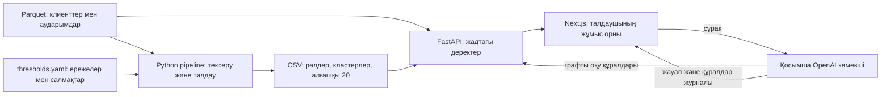

# MoneyGraph — ақша ағындарының графы

[Русский](README.md) · **Қазақша** · [English](README.en.md)

HackAlem үшін әзірленген, ақша аударымдарын түсіндірілетін тәсілмен талдау құралы. MoneyGraph қаржылық мониторинг және AML талдаушыларына **қай клиенттерді алдымен тексеру керектігін және бұл тексеруді қандай байқалған байланыстар негіздейтінін** анықтауға көмектеседі.

Мыңдаған аударымды қолмен қараудың орнына талдаушы тексеру кезегін, клиенттердің графтағы рөлдерін, өзара байланысты топтарды және сандық түсіндірмелерді алады. Нәтижелер — тергеуге арналған болжамдар, кінә туралы қорытынды емес.

## Іске асырылған мүмкіндіктер

- Үш Parquet файлын жүктеу және тексеру: клиенттер, жинақталған байланыстар және транзакциялар.
- Бағытталған ақша графын құру; айналымды, байланыстарды, ұсталып қалған қаражатты, жылдам әрі қарай аударуды, PageRank, betweenness және бастапқы клиенттермен (`seed`) байланысты есептеу.
- Әр клиентке түсіндірілетін бір рөл тағайындау, Louvain әдісімен қауымдастықтарды анықтау және тексеру басымдығын есептеу.
- Үш CSV нәтижесі: барлық клиенттердің рөлдері, кластерлер жиынтығы және алғашқы 20 клиент.
- Веб-интерфейс: басымдық кезегі, нақты GID бойынша іздеу, клиент айналасының интерактивті графы, көрші түйіндерге өту, түсіндірмелері бар карточка және кластер туралы ақпарат.
- Графты шолу шекарасы мен бастапқы клиенттердің толық емес кіріс ағындары туралы ескертулер.
- Қосымша AI көмекші: табиғи тілде сұрақ қою, графты талдау құралдары және олардың шақырылу журналы.
- Орыс, қазақ және ағылшын тілдерін ауыстыру. Сұрақ үлгілері мен AI нұсқаулары таңдалған тілге бейімделеді; көмекші сол тілде жауап беру нұсқауын алады.

### Рөлдер және басымдық

Ережелер кестедегі ретпен тексеріледі: бірінші сәйкес келгені рөлді анықтайды. Нақты шектер [config/thresholds.yaml](config/thresholds.yaml) файлында, іске асырылуы [backend/app/analysis](backend/app/analysis) бумасында берілген.

| Рөл | Негізгі белгі |
|---|---|
| `coordinator` — үйлестіруші | Seed емес түйін үшін кіріс және шығыс байланыстары болуы керек; оған қоса кемінде 3 жіберуші мен 3 алушы немесе жалпы дәреже ≥ 8 және құрылымдық балл ≥ 0,90. Seed үшін кемінде 8 алушы және құрылымдық балл ≥ 0,90 қажет. |
| `distributor` — таратушы | Шығыс әрекеті бақыланатын түйінде кемінде 5 бірегей алушы бар. |
| `consolidator` — жинақтаушы | Seed емес түйін: кемінде 3 жіберуші, ең көбі 2 алушы, кіріс көлемі ≥ 100 000 KZT. |
| `transit` — транзит | Кіріс және шығыс байланыстары бар, seed емес түйін: шығыс/кіріс қатынасы 0,50–1,50; 0–2 күн ішінде жылдам әрі қарай аудару үлесі ≥ 0,50. |
| `terminal` — қаражатты ұстап қалушы | Бақылау шекарасында емес, seed емес түйін: кіріс және ұсталған көлем ≥ 100 000 KZT, ұсталған үлес ≥ 0,80, ең көбі 1 алушы. |
| `peripheral` — шеткі түйін | Қалған түйіндер; 4-тереңдіктегі барлық түйін осы рөлді және бақылау шекарасы туралы ескертуді алады. |

`priority_score` бес құрамдастан тұрады: рөлдің айқындық бағасы **25%**, ақшалай маңыздылық **27%**, құрылымдық маңыздылық **15%**, seed түйіндерімен байланыс **17%**, аномалия белгілері **16%**. Құрылымдық маңыздылық PageRank, betweenness және түйін дәрежесінің процентильдік бағаларын біріктіреді. Аномалия белгілері жылдам әрі қарай аударуды, ағын теңгерімсіздігін және транзакциялар санын ескереді.

`role_score` және `priority_score` 0–1 аралығында болады және **заң бұзу ықтималдығын білдірмейді**. Қысқа `evidence` түсіндірмесінде байқалған көрсеткіштер беріледі; оның ұзындығы 200 таңбадан аз.

## Шешім қалай жұмыс істейді

1. Ұйымдастырушы клиенттердің GID идентификаторлары мен аударымдары бар иесіздендірілген Parquet файлдарын береді.
2. Талдау pipeline-ы файлдардың сәйкестігін тексеріп, белгілерді, рөлдерді, кластерлерді және басымдықтарды есептейді, CSV нәтижелерін сақтайды.
3. Backend деректер мен нәтижелерді жүктеп, олардың қолданыстағы ережелерге сәйкестігін тексереді және API арқылы ұсынады.
4. Талдаушы кезектен клиентті таңдап, басымдық себептерін, аударым бағыттарын, көршілерін және кластерін қарайды. GID бойынша іздеу алғашқы 20 клиентке кірмеген клиентті де ашуға мүмкіндік береді.
5. OpenAI бапталған болса, талдаушы қосымша сұрақ қояды; көмекші граф құралдарына жүгініп, түсіндірме береді. Әрі қарай тексеру туралы шешімді адам қабылдайды.

## Технологиялар

| Қабат | Қолданылатын құралдар |
|---|---|
| Талдау | Python, pandas, NumPy, PyArrow, NetworkX, SciPy, PyYAML |
| Backend | FastAPI, Uvicorn, Pydantic, python-dotenv |
| Frontend | TypeScript, Next.js 15, React 19, Cytoscape.js |
| Деректер | Кірісте Parquet, шығыста CSV; процесс жадындағы деректер репозиторийі |
| Қосымша AI | OpenAI Python SDK, Responses API; әдепкі модель — `gpt-4.1-mini`, `OPENAI_MODEL` арқылы өзгертіледі |

Рөлдер, кластерлер және рейтингтер LLM арқылы емес, алгоритмдер мен ережелер арқылы есептеледі. Жобаға арнайы үйретілген ML моделі қолданылмайды. Тәуелділіктер: [backend/requirements.txt](backend/requirements.txt) және [frontend/package.json](frontend/package.json); frontend үшін lockfile сақталған.

## Жоба архитектурасы



Backend іске қосылғанда нәтижелерді тексеру үшін ресурсты көп қажет ететін есептеулерді орындайды, кейін сұрауларға кэштелген репозиторийден жауап береді. Браузерге бүкіл граф емес, таңдалған түйіннің шектеулі айналасы жіберіледі. Ұзын идентификаторлар JavaScript-та дәл сақталуы үшін GID жол түрінде беріледі.

```text
backend/pipeline.py     талдауды іске қосу және CSV тексеру
backend/app/analysis/  белгілер, рөлдер, кластерлер, рейтинг, түсіндірмелер
backend/app/api/       деректер репозиторийі, схемалар, HTTP маршруттары
backend/app/agent/     AI көмекші және граф құралдары
frontend/             Next.js интерфейсі
config/thresholds.yaml ережелер мен салмақтар
data/                 бастапқы Parquet файлдары
output/               CSV нәтижелері
starter/starter.py    ұйымдастырушының жүктегіші және граф құрастырушысы
docs/architecture.md  архитектураның толық сипаттамасы
```

API: `GET /health`, `GET /api/summary`, `GET /api/priorities`, `GET /api/nodes/{gid}`, `GET /api/nodes/{gid}/graph`, `GET /api/clusters`, `GET /api/clusters/{cluster_id}`, `POST /api/investigator`. Талдау операциялары тек оқуға арналған; POST бастапқы деректерді өзгертпейді.

Толық құжаттама: [архитектура](docs/architecture.kk.md) · [интерфейс пен AI тілдерін баптау](docs/frontend-localization.kk.md).

## Орнату және іске қосу

Python, npm бар Node.js және репозиторийді алу үшін Git қажет. Жергілікті талдау Python 3.14.3 нұсқасында тексерілді; орнатылған Node.js нұсқасы — 24.21.0. Командаларды `backend/`, `frontend/` және `data/` орналасқан **репозиторийдің түбірлік бумасынан** орындаңыз. Деректер репозиторийге қосылған. Интернет тәуелділіктерді орнату және қосымша OpenAI сұраулары үшін қажет.

### Windows PowerShell

1. Тәуелділіктерді орнатыңыз:

```powershell
python -m venv .venv
.\.venv\Scripts\python.exe -m pip install -r backend\requirements.txt
Set-Location frontend
npm.cmd ci
Set-Location ..
```

Егер `python` командасы қолжетімсіз, бірақ Python Launcher орнатылған болса, бірінші жолда `py -m venv .venv` қолданыңыз. Ортаны белсендіру міндетті емес.

2. Нәтижелерді есептеп, backend-ті іске қосыңыз:

```powershell
.\.venv\Scripts\python.exe backend\pipeline.py
.\.venv\Scripts\python.exe -m uvicorn backend.app.main:app --reload
```

3. **Басқа терминалда**, репозиторийдің түбірлік бумасынан frontend-ті іске қосыңыз:

```powershell
Set-Location frontend
npm.cmd run dev
```

### Linux / macOS

1. Тәуелділіктерді орнатып, нәтижелерді есептеңіз:

```bash
python3 -m venv .venv
.venv/bin/python -m pip install -r backend/requirements.txt
cd frontend
npm ci
cd ..
.venv/bin/python backend/pipeline.py
```

2. Backend-ті іске қосыңыз:

```bash
.venv/bin/python -m uvicorn backend.app.main:app --reload
```

3. Басқа терминалда, репозиторийдің түбірлік бумасынан frontend-ті іске қосыңыз:

```bash
cd frontend
npm run dev
```

Тәуелділіктер орнатылғаннан кейін GNU Make бар болса, Windows және Linux/macOS жүйелерінде `make analyze`, `make backend`, `make frontend` командаларын қолдануға болады. Makefile Python жолын операциялық жүйеге қарай таңдайды. Make болмаса, жоғарыдағы толық командаларды қолданыңыз.

[Интерфейсті](http://localhost:3000), [Swagger API құжаттамасын](http://127.0.0.1:8000/docs) немесе [backend күйін тексеруді](http://127.0.0.1:8000/health) ашыңыз. Uvicorn қолданбаның сәтті іске қосылғанын хабарлағанша күтіңіз. Тоқтату үшін әр терминалда `Ctrl+C` басыңыз.

### API және AI баптауы

Қалыпты іске қосу үшін `.env` файлы мен кілттер қажет емес. Frontend әдепкіде `http://localhost:8000` адресіне жүгінеді.

AI үшін **репозиторийдің түбірінде** өз кілтіңіз жазылған `.env` файлын жасаңыз:

```dotenv
OPENAI_API_KEY=your-api-key
OPENAI_MODEL=gpt-4.1-mini
```

Backend-ті қайта іске қосыңыз. Кілт тек серверге қолжетімді; `.env` Git-ке қосылмайды. Кілтсіз AI endpoint түсіндірмесі бар HTTP 503 қайтарады, қалған мүмкіндіктер қолжетімді болады.

Backend адресін өзгерту қажет болса, оны **`frontend/.env.local`** файлында бөлек көрсетіп, frontend-ті қайта іске қосыңыз:

```dotenv
NEXT_PUBLIC_API_BASE_URL=http://localhost:8000
```

Next.js осы репозиторийдің түбіріндегі `.env` файлын frontend баптауы ретінде жүктемейді. `.env.example` ішіндегі `MONEYGRAPH_*` айнымалылары қазір жолдарды таңдауға қосылмаған. Pipeline `--data`, `--config`, `--out` параметрлерін қабылдайды; API стандартты `data/`, `config/thresholds.yaml`, `output/` жолдарын қолданады.

### Іске қосу кезіндегі жиі мәселелер

- `npm` табылмады: npm бар Node.js орнатып, жаңа терминал ашыңыз.
- `ENOENT ... package.json`: npm командаларын түбірде емес, `frontend/` ішінде орындаңыз.
- `-m` танылмады: оның алдына жоғарыдағыдай Python орындалатын файлын жазыңыз.
- `No module named scipy`: `.venv` ішіндегі Python арқылы `backend/requirements.txt` тәуелділіктерін қайта орнатыңыз.
- Backend CSV файлдарының ескіргенін хабарлады: pipeline-ды қайта орындап, backend-ті қайта іске қосыңыз.
- Frontend 3001 портын таңдады: осы қолданба үшін 3000 портын босатыңыз. Backend CORS әдепкіде тек `localhost:3000` және `127.0.0.1:3000` адрестеріне рұқсат береді; басқа адрестер үшін CORS баптауын өзгерту қажет.

## Шешімді тексеру: қазылар алқасына арналған сценарий

1. Операциялық жүйеңізге арналған pipeline командасын орындаңыз. Қосылған деректер мен қолданыстағы ережелер үшін **2 248 клиент жолы, 91 кластер және 20 басымдық жолы** күтіледі. Pipeline толықтықты, балл шектерін, түсіндірме ұзындығын және рейтинг ретін өзі тексереді.
2. `output/nodes_roles.csv`, `output/clusters.csv`, `output/top_nodes.csv` файлдарын қараңыз. Рөлдер саны: 91 coordinator, 70 distributor, 83 consolidator, 77 transit, 335 terminal, 1 592 peripheral.
3. Екі серверді іске қосыңыз. `/health` адресінде `{"status":"ok"}` күтіледі. `/api/summary` ішінде 2 248 клиент, 3 119 байланыс, 4 840 транзакция және 81 seed барын тексеріңіз.
4. [MoneyGraph](http://localhost:3000) ашыңыз. Орыс, қазақ және ағылшын тілдерін ауыстырып көріңіз. Басымдық кезегінің (ағылшынша `Priority nodes`) бірінші жолын таңдаңыз: GID **`100000004156082100`**, рөлі `coordinator`, басымдығы шамамен **0,901633**. Рейтинг құрамдастарын, түсіндірмені, кіріс және шығыс байланыстарын қараңыз.
5. Графтағы көрші түйінді басыңыз: оның карточкасы мен айналасы ашылуы керек. Кластер туралы ақпаратты тексеріңіз.
6. Нақты GID **`100000000404740100`** бойынша іздеңіз. Бұл 4-тереңдіктегі түйін: `peripheral` рөлі және шығыс бақылауының толық еместігі туралы ескерту күтіледі. Байқалған шығыс көлемінің нөл болуы оны соңғы алушы деп тануға негіз болмайды.
7. Қосымша тексеру үшін OpenAI кілтімен `GID 100000004156082100 басымдығы неге жоғары?` деп сұраңыз. Құралдар журналын қарап, жауапты клиент карточкасымен салыстырыңыз. Тілді ауыстырып, сұрақ үлгілерінің аудармасын тексеріңіз және жаңа сұрау жіберіңіз: AI таңдалған тілде жауап беру нұсқауын алады. Жауаптың тұжырымдалуы өзгеруі мүмкін.

Негізгі сценарий OpenAI-сыз толық қолжетімді. Деректер, ережелер және кітапхана нұсқалары бірдей болса, талдау нәтижелері қайталанады; backend тәуелділіктерінің нақты нұсқалары бекітілмеген.

## Деректер және интеграциялар

| Дереккөз / нәтиже | Мазмұны |
|---|---|
| `data/nodes.parquet` | GID, шолу тереңдігі және seed белгісі бар 2 248 клиент; 81 seed, 4-тереңдік шекарасындағы 444 түйін |
| `data/edges.parquet` | 3 119 бағытталған байланыс: жіберуші, алушы, KZT сомасы және аударым саны |
| `data/transactions.parquet` | Күні мен сомасы бар 4 840 транзакция |
| `output/nodes_roles.csv` | `gid`, `role`, `role_score`, `cluster_id`, `priority_score`, `evidence` |
| `output/clusters.csv` | Кластер өлшемдері, seed саны, ішкі көлем, негізгі GID және болжам |
| `output/top_nodes.csv` | Кезектегі орын, GID, рөл, басымдық және тексеру себебі |

Бастапқы файлдарды ұйымдастырушы берген; бұл нақты уақыттағы банк қосылымы емес, шектеулі иесіздендірілген деректер жиынтығы. Сыртқы тізілімдер, KYC және басқа банктердің деректері қосылмаған.

Жалғыз қосымша сыртқы интеграция — OpenAI. Ол қолданылғанда сервер сұрақ пен шақырылған құралдардың нәтижелерін, соның ішінде GID және граф көрсеткіштерін жібереді. Қолжетімді құралдар: `node_card`, `common_receivers`, `paths`, `filter_nodes`, `cluster_summary`, `what_if_remove`; бір сұраққа ең көбі бес шақыру. Соңғы құрал графтан түйіндерді алып тастауды модельдейді; нақты аударымдарды бұғаттамайды.

## Қазіргі нұсқаның шектеулері

- Тек берілген банк ішіндегі аударымдар бақыланады; 5 000 KZT-ден аз аударымдар жоқ. Шығыс шолуы 3-тереңдікте аяқталады, 4-тереңдік — шекара. Seed түйіндерінің кіріс ағындары толық емес.
- Күндер тәулік дәлдігімен берілген. Жылдам әрі қарай аудару — уақыттық белгі; ол дәл сол қаражаттың қозғалғанын немесе бір күн ішіндегі операциялардың ретін дәлелдемейді.
- Шектер хакатон деректеріне бейімделген. Pipeline тексеруі дәл 2 248 клиентті күтеді; басқа жиынтық үшін бейімдеу қажет. Есептеулер жадта орындалады; миллиондаған түйінге масштабтау тексерілмеген.
- Louvain қарама-қарсы аударым сомалары қосылған бағытталмаған проекцияны, `resolution=1.0` және `seed=42` параметрлерін қолданады. Басқа есептеулерде және граф көрінісінде бағыттар сақталады.
- Дерекқор, авторизация, UI арқылы файл жүктеу, ағындық жаңарту, талдаушы шешімдерінің журналы және тергеулерді сақтау жоқ. Интерфейс компьютер экранына арналған. API/CSV өрістері мен рөлдерінің машиналық кодтары интерфейс тіліне қарамастан ағылшынша қалады.
- Үйретілген модель, жетіспейтін аударымдарды болжау және тергеудің толық уақыт шкаласы іске асырылмаған. Архитектуралық ұсыныстарды дайын мүмкіндік деп санауға болмайды.
- AI қателесуі мүмкін. Код жауаптағы 18 таңбалы GID-лерді құрал нәтижелерімен салыстырады, бірақ барлық тұжырым мен санды автоматты түрде толық тексермейді. Жауаптарды деректермен салыстыру қажет.
- Бұл — талдауды көрсетуге арналған прототип. Бағалар дәлелденген заңсыз әрекетті емес, қолмен тексеру басымдығын білдіреді.

## Жария орналастырылған нұсқа

Репозиторийде жария орналастырылған нұсқаның сілтемесі көрсетілмеген. Демонстрация үшін жергілікті қолданбаны пайдаланыңыз: [http://localhost:3000](http://localhost:3000). Бұл адрес қолданбаны өз компьютеріңізде іске қосқаннан кейін қолжетімді болады.
