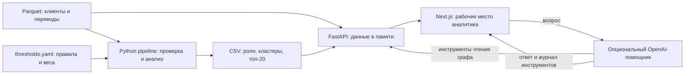

# MoneyGraph — граф денег

**Русский** · [Қазақша](README.kk.md) · [English](README.en.md)

Объяснимый анализ денежных переводов для HackAlem. MoneyGraph помогает аналитикам финансового мониторинга и AML определить, **кого проверить в первую очередь и какие наблюдаемые связи обосновывают эту проверку**.

Вместо ручного просмотра тысяч переводов аналитик получает приоритетную очередь клиентов, роли в графе, группы связанных участников и числовые объяснения. Результат — гипотезы для расследования, а не заключение о виновности.

## Что реализовано

- Загрузка и проверка трёх Parquet-файлов: клиенты, агрегированные связи и транзакции.
- Построение ориентированного денежного графа; расчёт оборотов, связей, удержания средств, быстрого перенаправления, PageRank, betweenness и связности с исходными клиентами (`seed`).
- Объяснимая роль для каждого клиента, сообщества Louvain и рейтинг приоритета проверки.
- Три CSV-результата: роли всех клиентов, сводка кластеров и топ-20.
- Веб-интерфейс: очередь приоритетов, поиск по точному GID, интерактивный граф окружения, переход по соседним узлам, карточка с объяснениями и контекст кластера.
- Предупреждения о границе обхода графа и неполных входящих потоках исходных клиентов.
- Опциональный AI-помощник: вопросы к графу на естественном языке, инструменты анализа и журнал их вызовов.
- Переключение интерфейса между русским, казахским и английским. Примеры вопросов и инструкции AI учитывают выбранный язык; помощник получает указание отвечать на нём.

### Роли и приоритет

Правила применяются в порядке таблицы: первое подходящее определяет роль. Точные пороги находятся в [config/thresholds.yaml](config/thresholds.yaml), реализация — в [backend/app/analysis](backend/app/analysis).

| Роль | Основной сигнал |
|---|---|
| `coordinator` — координатор | Для не-seed: есть входящие и исходящие связи, не менее 3 отправителей и 3 получателей либо степень ≥ 8 и структурный балл ≥ 0,90. Для seed: не менее 8 получателей и структурный балл ≥ 0,90. |
| `distributor` — распределитель | Не менее 5 уникальных получателей при наблюдаемом исходящем потоке. |
| `consolidator` — консолидатор | Для не-seed: не менее 3 отправителей, не более 2 получателей, входящий объём ≥ 100 000 KZT. |
| `transit` — транзит | Для не-seed с входящими и исходящими связями: отношение исходящего к входящему объёму 0,50–1,50; доля быстрого перенаправления ≥ 0,50 в окне 0–2 дня. |
| `terminal` — удержание средств | Для не-seed вне границы наблюдения: входящий и удержанный объём ≥ 100 000 KZT, удержанная доля ≥ 0,80, не более 1 получателя. |
| `peripheral` — периферийный | Остальные узлы; все узлы глубины 4 получают эту роль с предупреждением о границе наблюдения. |

Рейтинг `priority_score` — сумма пяти компонентов: сила роли **25%**, денежная значимость **27%**, структурная важность **15%**, связь с seed **17%**, признаки аномального поведения **16%**. Структурная важность объединяет процентильные оценки PageRank, betweenness и степени узла. Аномальные признаки учитывают быстрое перенаправление, дисбаланс потоков и количество транзакций.

`role_score` и `priority_score` лежат в диапазоне 0–1 и **не являются вероятностями нарушения закона**. Краткое `evidence` содержит наблюдаемые показатели и занимает менее 200 символов.

## Как работает решение

1. Организатор предоставляет обезличенные Parquet-файлы с GID клиентов и переводами.
2. Аналитический pipeline проверяет согласованность файлов, рассчитывает признаки, роли, кластеры и приоритеты, сохраняет CSV.
3. Backend загружает данные и результаты, проверяет их согласованность с текущими правилами и предоставляет API.
4. Аналитик выбирает клиента из очереди и изучает причины приоритета, направления переводов, соседей и кластер. Поиск по GID позволяет открыть клиента вне топ-20.
5. При настроенном OpenAI аналитик задаёт уточняющий вопрос; помощник обращается к инструментам графа и возвращает объяснение. Решение о дальнейшей проверке принимает человек.

## Технологии

| Слой | Используется |
|---|---|
| Анализ | Python, pandas, NumPy, PyArrow, NetworkX, SciPy, PyYAML |
| Backend | FastAPI, Uvicorn, Pydantic, python-dotenv |
| Frontend | TypeScript, Next.js 15, React 19, Cytoscape.js |
| Данные | Parquet на входе, CSV на выходе; репозиторий данных в памяти процесса |
| Опциональный AI | Python SDK OpenAI, Responses API; модель по умолчанию `gpt-4.1-mini`, замена через `OPENAI_MODEL` |

Роли, кластеры и рейтинги рассчитываются алгоритмами и правилами, без LLM. Собственная обученная ML-модель не используется. Зависимости: [backend/requirements.txt](backend/requirements.txt) и [frontend/package.json](frontend/package.json); для frontend сохранён lockfile.

## Архитектура проекта



Backend выполняет дорогие расчёты для проверки результатов при старте, затем обслуживает запросы из кешированного репозитория. В браузер передаётся ограниченное окружение выбранного узла, а не весь граф. GID передаются строками, чтобы JavaScript не терял точность длинных идентификаторов.

```text
backend/pipeline.py     запуск анализа и проверка CSV
backend/app/analysis/  признаки, роли, кластеры, рейтинг, объяснения
backend/app/api/       репозиторий данных, схемы и HTTP-маршруты
backend/app/agent/     AI-помощник и инструменты графа
frontend/             интерфейс Next.js
config/thresholds.yaml правила и веса
data/                 исходные Parquet-файлы
output/               CSV-результаты
starter/starter.py    загрузчик и построитель графа организатора
docs/architecture.md  подробное описание архитектуры
```

API: `GET /health`, `GET /api/summary`, `GET /api/priorities`, `GET /api/nodes/{gid}`, `GET /api/nodes/{gid}/graph`, `GET /api/clusters`, `GET /api/clusters/{cluster_id}`, `POST /api/investigator`. Все операции анализа работают на чтение; POST не изменяет исходные данные.

Подробная документация: [архитектура](docs/architecture.md) · [локализация интерфейса и AI](docs/frontend-localization.md).

## Установка и запуск

Нужны Python, Node.js с npm и Git для получения репозитория. Локальная проверка анализа выполнена на Python 3.14.3; установленная версия Node.js — 24.21.0. Команды ниже выполняются **из корня репозитория**, где находятся `backend/`, `frontend/` и `data/`. Данные уже включены в репозиторий. Интернет нужен для установки зависимостей и опциональных запросов к OpenAI.

### Windows PowerShell

1. Установите зависимости:

```powershell
python -m venv .venv
.\.venv\Scripts\python.exe -m pip install -r backend\requirements.txt
Set-Location frontend
npm.cmd ci
Set-Location ..
```

Если команда `python` недоступна, но установлен Python Launcher, используйте `py -m venv .venv` в первой строке. Активация окружения не требуется.

2. Рассчитайте результаты и запустите backend:

```powershell
.\.venv\Scripts\python.exe backend\pipeline.py
.\.venv\Scripts\python.exe -m uvicorn backend.app.main:app --reload
```

3. В **другом терминале**, также из корня проекта, запустите frontend:

```powershell
Set-Location frontend
npm.cmd run dev
```

### Linux / macOS

1. Установите зависимости и рассчитайте результаты:

```bash
python3 -m venv .venv
.venv/bin/python -m pip install -r backend/requirements.txt
cd frontend
npm ci
cd ..
.venv/bin/python backend/pipeline.py
```

2. Запустите backend:

```bash
.venv/bin/python -m uvicorn backend.app.main:app --reload
```

3. В другом терминале из корня проекта запустите frontend:

```bash
cd frontend
npm run dev
```

После установки зависимостей, если установлен GNU Make, доступны сокращения `make analyze`, `make backend`, `make frontend` на Windows и Linux/macOS. Makefile выбирает путь к Python в зависимости от ОС. Без Make используйте явные команды выше.

Откройте [интерфейс](http://localhost:3000), [Swagger API](http://127.0.0.1:8000/docs) или [проверку backend](http://127.0.0.1:8000/health). Дождитесь сообщения Uvicorn об успешном завершении запуска. Для остановки нажмите `Ctrl+C` в каждом терминале.

### Настройка API и AI

Для обычного запуска `.env` и ключи не нужны. Frontend обращается к `http://localhost:8000` по умолчанию.

Для AI создайте **в корне репозитория** файл `.env` с собственным ключом:

```dotenv
OPENAI_API_KEY=your-api-key
OPENAI_MODEL=gpt-4.1-mini
```

Перезапустите backend. Ключ доступен только серверу; `.env` исключён из Git. Без ключа AI endpoint возвращает HTTP 503 с пояснением, остальные функции доступны.

Если нужен другой адрес backend, задайте его отдельно в **`frontend/.env.local`** и перезапустите frontend:

```dotenv
NEXT_PUBLIC_API_BASE_URL=http://localhost:8000
```

Next.js не загружает корневой `.env` этого репозитория как конфигурацию frontend. Переменные `MONEYGRAPH_*` из `.env.example` сейчас не подключены к выбору путей. Pipeline принимает параметры `--data`, `--config`, `--out`; API использует стандартные `data/`, `config/thresholds.yaml`, `output/`.

### Частые проблемы запуска

- `npm` не найден: установите Node.js с npm и откройте новый терминал.
- `ENOENT ... package.json`: запускайте npm внутри `frontend/`, а не в корне.
- `-m` не распознано: перед ним должно быть имя Python, как в командах выше.
- `No module named scipy`: повторите установку `backend/requirements.txt` через Python из `.venv`.
- Backend сообщает об устаревших CSV: снова выполните pipeline и перезапустите backend.
- Frontend выбрал порт 3001: освободите порт 3000 для этого приложения. CORS backend по умолчанию разрешает только `localhost:3000` и `127.0.0.1:3000`; другие адреса требуют изменения настройки CORS.

## Как проверить решение: сценарий для жюри

1. Выполните pipeline командой для своей ОС. Для включённого набора и текущих правил ожидаются **2 248 строк клиентов, 91 кластер и 20 строк приоритетов**. Pipeline сам проверяет полноту, диапазоны оценок, длину объяснений и сортировку рейтинга.
2. Проверьте три файла в `output/`: `nodes_roles.csv`, `clusters.csv`, `top_nodes.csv`. Распределение ролей: 91 coordinator, 70 distributor, 83 consolidator, 77 transit, 335 terminal, 1 592 peripheral.
3. Запустите оба сервера. Откройте `/health`: ожидается `{"status":"ok"}`. В `/api/summary` проверьте 2 248 клиентов, 3 119 связей, 4 840 транзакций и 81 seed.
4. Откройте [MoneyGraph](http://localhost:3000). Проверьте переключение между русским, казахским и английским. В очереди приоритетов (`Priority nodes` на английском) выберите первую строку: GID **`100000004156082100`**, роль `coordinator`, приоритет примерно **0,901633**. Изучите компоненты рейтинга, объяснение, входящие и исходящие связи.
5. Нажмите соседний узел на графе: карточка и окружение должны переключиться на него. Проверьте контекст кластера в карточке.
6. Найдите точный GID **`100000000404740100`**. Это узел глубины 4: ожидаются роль `peripheral` и предупреждение о неполноте исходящих наблюдений. Нулевой наблюдаемый исходящий поток не делает его конечным получателем.
7. Опционально, с ключом OpenAI, задайте `Почему у GID 100000004156082100 высокий приоритет?`. Проверьте журнал вызванных инструментов и сопоставьте ответ с карточкой клиента. Переключите язык, проверьте перевод примеров вопросов и отправьте новый запрос: AI получает инструкцию отвечать на выбранном языке. Формулировка AI-ответа может меняться.

Основной сценарий доступен без OpenAI. Результаты анализа воспроизводятся при одинаковых данных, правилах и версиях библиотек; backend-зависимости не закреплены до точных версий.

## Данные и интеграции

| Источник / результат | Содержание |
|---|---|
| `data/nodes.parquet` | 2 248 клиентов с GID, глубиной обхода и признаком seed; 81 seed, 444 узла на границе глубины 4 |
| `data/edges.parquet` | 3 119 направленных связей: отправитель, получатель, сумма KZT и число переводов |
| `data/transactions.parquet` | 4 840 транзакций с датой и суммой |
| `output/nodes_roles.csv` | `gid`, `role`, `role_score`, `cluster_id`, `priority_score`, `evidence` |
| `output/clusters.csv` | Размеры кластеров, число seed, внутренний объём, ключевые GID и гипотеза |
| `output/top_nodes.csv` | Место в очереди, GID, роль, приоритет и причина проверки |

Входные файлы предоставлены организатором; это ограниченная обезличенная выгрузка, а не подключение к банковской системе в реальном времени. Внешние реестры, KYC и данные других банков не подключены.

Единственная опциональная внешняя интеграция — OpenAI. При её использовании сервер отправляет вопрос и результаты вызванных инструментов, включая GID и показатели графа. Доступны `node_card`, `common_receivers`, `paths`, `filter_nodes`, `cluster_summary`, `what_if_remove`, максимум пять вызовов на вопрос. Последний инструмент моделирует удаление узлов из графа; он не блокирует реальные операции.

## Ограничения текущей версии

- Наблюдаются внутрибанковские переводы из предоставленной выгрузки; переводы меньше 5 000 KZT отсутствуют. Исходящий обход ограничен глубиной 3, глубина 4 — граница. Входящие потоки seed неполны.
- Даты имеют точность до дня. Быстрое перенаправление — временной признак, а не доказательство движения тех же денег или порядка операций внутри дня.
- Пороги настроены под набор хакатона. Проверка pipeline явно ожидает 2 248 клиентов; для другого набора потребуется адаптация. Расчёты выполняются в памяти, масштабирование на миллионы узлов не проверялось.
- Louvain использует неориентированную проекцию с суммированием встречных объёмов, `resolution=1.0`, `seed=42`. Направления сохраняются в остальных расчётах и отображении графа.
- Нет базы данных, авторизации, загрузки файлов через UI, потокового обновления, журнала решений аналитика и сохранения расследований. Интерфейс ориентирован на настольный экран. Машинные коды ролей и полей API/CSV сохраняются на английском независимо от языка интерфейса.
- Обучаемая модель, прогноз недостающих переводов и полноценный временной анализ расследования не реализованы. Архитектурные идеи не следует считать готовыми функциями.
- AI может ошибаться. Код проверяет упомянутые 18-значные GID по результатам инструментов, но не выполняет полную автоматическую проверку всех утверждений и чисел. Ответы следует сверять с данными.
- Это демонстрационный аналитический прототип; оценки обозначают приоритет ручной проверки, а не доказанную противоправную деятельность.

## Deployed-версия

Публичная ссылка на развёрнутую версию в репозитории не указана. Для демонстрации используйте локальный запуск: [http://localhost:3000](http://localhost:3000). Это локальный адрес, доступный после запуска приложения на вашем компьютере.
