# MoneyGraph архитектурасы

[Русский](architecture.md) · **Қазақша** · [English](architecture.en.md)

MoneyGraph детерминдік талдауды интерфейстен және тілдік модельдің қосымша көмегінен бөледі. Дерекқор жоқ: жасалған CSV нәтижелері мен ұйымдастырушының Parquet файлдары тек оқуға арналған кэштелген FastAPI репозиторийіне жүктеледі.

```mermaid
flowchart LR
    P[Ұйымдастырушының Parquet файлдары<br/>түйіндер · байланыстар · транзакциялар]
    D[Детерминдік граф қозғалтқышы<br/>жүктеу · тексеру · белгілер]
    A[Түсіндірілетін талдау<br/>рөлдер · кластерлер · рейтинг · негіздемелер]
    C[CSV нәтижелері<br/>nodes_roles · clusters · top_nodes]
    R[Кэштелген FastAPI репозиторийі<br/>тек оқуға арналған API]
    U[Next.js жұмыс орны<br/>кезек · іздеу · айнала графы · негіздемелер]
    I[Қосымша OpenAI көмекші<br/>шектелген Responses API циклі]
    T[Графты оқу құралдары<br/>түйін · алушылар · жолдар · сүзгі · кластер · алып тастау]
    G[Деректерге негізделген жауап<br/>болжамдар және GID сілтемелері]

    P --> D --> A --> C --> R --> U
    U -->|қосымша сұрақ| I
    I -->|ең көбі 5 құрал шақыруы| T
    T -->|кэштелген деректерден фактілер| R
    T --> G --> U
```

## Компоненттердің міндеттері

### Ұйымдастырушының бастапқы деректері

`data/nodes.parquet`, `data/edges.parquet` және `data/transactions.parquet` файлдарында берілген графтың деректер көшірмесі сақталады. Талдау pipeline-ы `starter/starter.py` файлындағы ұйымдастырушының Parquet жүктегішін және бағытталған граф құрастырушысын қайта пайдаланады.

Деректер жиынтығының бақылау шекарасы бар. Шығыс шолуы 3-тереңдіктен кейін аяқталады, сондықтан 4-тереңдік әрі қарайғы бақылаудың шекарасы болып саналады. Seed түйіндерінің кіріс ағындары толық емес; тек берілген банк ішіндегі шығыс шолу байланыстары көрінеді; 5 000 KZT-ден аз аударымдар жоқ.

### Детерминдік граф қозғалтқышы

`backend/app/analysis/features.py` файлдар арасындағы сәйкестікті тексеріп, бағытталған салмақталған граф құрады. Ол құрылымдық, ақшалай, транзакциялық және уақыттық белгілерді, seed түйіндерімен байланысты және бақылаудың толықтығын есептейді. Осы есептеулердің барлығында бағыттар сақталады.

Жылдам әрі қарай аударуды бағалау үшін аударымға дейінгі соңғы байқалған түсім және бапталған 0–2 күндік аралық қолданылады. Күндер тәулік дәлдігімен берілгендіктен, бір күн ішіндегі операциялардың реті немесе қаражаттың дәл сол қаражат екені анықталмайды.

### Түсіндірілетін талдау

`roles.py` ережелердің басымдық ретімен `config/thresholds.yaml` шектерін қолданып, дәл бір рөл тағайындайды. 4-тереңдіктегі түйіндер байқалған шығыс байланыстары нөл болғаны үшін соңғы алушы деп танылмайды: оларға `peripheral` рөлі және бақылау шекарасы туралы ескерту беріледі. Seed ережелері толық емес кіріс ағыны көрсеткіштерін қолданбайды.

`clustering.py` resolution 1.0 және seed 42 параметрлерімен салмақталған Louvain қауымдастықтарын анықтайды. Бағытталмаған проекция тек қауымдастықтарды іздеу үшін қолданылады; қарама-қарсы аударым сомалары қосылады. Қалған есептеулерде бағытталған деректер негізгі дереккөз болып қалады.

`ranking.py` рөлдің айқындық бағасын, ақшалай және құрылымдық маңыздылықты, seed байланысын және аномалия белгілерін қосындысы 1 болатын құжатталған салмақтармен біріктіреді. `evidence.py` байқалған көрсеткіштерді ұзындығы 200 таңбадан аз, сақтықпен тұжырымдалған сандық түсіндірмелерге айналдырады.

### CSV нәтижелері

`backend/pipeline.py` нәтижелерді тексеріп, әр CSV файлын атомарлы түрде ауыстырады:

- `output/nodes_roles.csv`
- `output/clusters.csv`
- `output/top_nodes.csv`

CSV файлдары детерминдік талдау нәтижелерінің көшірмесін сақтайды. Pipeline жол санын, схемаларды, толықтықты, рұқсат етілген рөлдерді, бағалар шектерін, кластерлердің қамтуын, негіздемелер ұзындығын және рейтинг ретін тексереді.

### Кэштелген FastAPI репозиторийі

FastAPI Parquet файлдарын, шектерді және CSV нәтижелерін іске қосылғанда немесе кэштелген репозиторий арқылы жүктеп, тексереді. Ресурсты көп қажет ететін граф көрсеткіштері әр сұрауда қайта есептелмейді. Нақты жауап модельдері бар API жиынтық ақпаратты, басымдықтарды, түйін карточкаларын, шектелген бағытталған айнала графтарын, кластерлерді және қосымша көмекші endpoint-ін ұсынады. Int64 дәлдігін сақтау үшін GID жол түрінде беріледі.

API тек оқуға арналған. Дерекқор, авторизация жүйесі және клиенттердің жеке басын анықтайтын анықтамалық деректер жоқ.

### Next.js жұмыс орны

TypeScript негізіндегі бір беттік интерфейс тексеру кезегін, нақты GID бойынша іздеуді, шектелген Cytoscape.js ақша графын, рөлдер мен рейтинг негіздемелерін, бақылаудың толық еместігі туралы ескертулерді және кластер туралы ақпаратты көрсетеді. Байланыс бағыттары мен байқалған көлемдер көрінеді. Интерфейс 2 248 түйіні бар толық графты емес, шағын айнала графтарын сұрайды.

### Қосымша OpenAI көмекші

Серверде жұмыс істейтін көмекші OpenAI Responses API қолданады. Цикл бір сұрауға бес құрал шақыруымен шектелген. Тек алты шектелген, оқуға арналған граф құралы қолжетімді: `node_card`, `common_receivers`, `paths`, `filter_nodes`, `cluster_summary` және `what_if_remove`.

Құралдар кэштелген детерминдік деректерге жүгініп, жауапта қолданылатын фактілерді қайтарады. Модель рөлдерді, кластерлерді, негіздемелерді немесе бағаларды тағайындамайды және байқалған байланыстарды не клиенттердің сыртқы атрибуттарын жасай алмайды. Жауаптағы GID құрал нәтижелерімен салыстырылады. 4-тереңдік пен seed кіріс ағынының толық еместігіне қатысты шектеулер сақталады; қорытындылар адам тексеретін болжам болып қалады.

`OPENAI_API_KEY` міндетті емес, оны тек backend жүктейді және ол браузер баптауына ешқашан қосылмайды. Кілтсіз негізгі pipeline, API және интерфейс жұмысын жалғастырады.

[MoneyGraph README](../README.kk.md)
