# Архитектура MoneyGraph

**Русский** · [Қазақша](architecture.kk.md) · [English](architecture.en.md)

MoneyGraph отделяет детерминированный анализ от интерфейса и опциональной помощи языковой модели. Базы данных нет: сформированный снимок CSV и Parquet-файлы организатора загружаются в кешированный репозиторий FastAPI, доступный только для чтения.

```mermaid
flowchart LR
    P[Parquet организатора<br/>узлы · связи · транзакции]
    D[Детерминированный графовый движок<br/>загрузка · проверка · признаки]
    A[Объяснимый анализ<br/>роли · кластеры · рейтинг · обоснования]
    C[Результаты CSV<br/>nodes_roles · clusters · top_nodes]
    R[Кешированный репозиторий FastAPI<br/>API только для чтения]
    U[Рабочее место Next.js<br/>очередь · поиск · граф окружения · обоснования]
    I[Опциональный OpenAI-помощник<br/>ограниченный цикл Responses API]
    T[Инструменты чтения графа<br/>узел · получатели · пути · фильтр · кластер · удаление]
    G[Ответ на основе данных<br/>гипотезы и ссылки на GID]

    P --> D --> A --> C --> R --> U
    U -->|необязательный вопрос| I
    I -->|максимум 5 вызовов инструментов| T
    T -->|факты из кешированных данных| R
    T --> G --> U
```

## Ответственность компонентов

### Входные данные организатора

`data/nodes.parquet`, `data/edges.parquet` и `data/transactions.parquet` содержат предоставленный снимок графа. Аналитический pipeline повторно использует загрузчик Parquet и построитель направленного графа организатора из `starter/starter.py`.

Выгрузка имеет границы наблюдения. Исходящий обход заканчивается после глубины 3, поэтому глубина 4 — граница дальнейших наблюдений. Входящие потоки seed неполны; видны только предоставленные внутрибанковские связи по исходящему обходу; переводы меньше 5 000 KZT отсутствуют.

### Детерминированный графовый движок

`backend/app/analysis/features.py` проверяет согласованность файлов и строит направленный взвешенный граф. Он рассчитывает структурные, денежные, транзакционные и временные признаки, связность с seed и признаки полноты наблюдения. Направления сохраняются во всех этих расчётах.

Для оценки быстрого перенаправления используется последнее наблюдаемое поступление перед переводом и настроенное окно 0–2 дня. Даты имеют точность до дня: порядок операций внутри дня и принадлежность средств не выводятся.

### Объяснимый анализ

`roles.py` назначает ровно одну роль в порядке приоритета правил с порогами из `config/thresholds.yaml`. Узлы глубины 4 не становятся конечными получателями из-за нулевого наблюдаемого числа исходящих связей: они получают роль `peripheral` и предупреждение о границе наблюдения. Правила для seed не используют неполные показатели входящего потока.

`clustering.py` выделяет взвешенные сообщества Louvain с параметрами resolution 1.0 и seed 42. Неориентированная проекция используется только для поиска сообществ; суммы встречных переводов складываются. В остальных расчётах источником истины остаются направленные данные.

`ranking.py` объединяет силу роли, денежную значимость, структурную важность, связь с seed и признаки аномалий с документированными весами, сумма которых равна 1. `evidence.py` преобразует наблюдаемые показатели в осторожные числовые объяснения длиной менее 200 символов.

### Результаты CSV

`backend/pipeline.py` проверяет результаты и атомарно заменяет каждый CSV-файл:

- `output/nodes_roles.csv`
- `output/clusters.csv`
- `output/top_nodes.csv`

CSV содержат снимок результатов детерминированного анализа. Pipeline проверяет число строк, схемы, полноту, допустимые роли, диапазоны оценок, покрытие кластеров, длину обоснований и порядок рейтинга.

### Кешированный репозиторий FastAPI

FastAPI загружает и проверяет Parquet, пороги и CSV при запуске или через кешированный репозиторий. Дорогие графовые показатели не пересчитываются для каждого запроса. API с явными моделями ответов предоставляет сводку, приоритеты, карточки узлов, ограниченные направленные графы окружения, кластеры и опциональный endpoint помощника. GID передаются строками для сохранения точности int64.

API работает только на чтение. Базы данных, системы авторизации и справочника идентификационных данных клиентов нет.

### Рабочее место Next.js

Одностраничный интерфейс на TypeScript показывает очередь проверок, поиск по точному GID, ограниченный денежный граф Cytoscape.js, обоснования ролей и рейтинга, предупреждения о неполноте наблюдения и контекст кластера. Направления связей и наблюдаемые объёмы остаются видимыми. Интерфейс запрашивает небольшие графы окружения, а не весь граф из 2 248 узлов.

### Опциональный OpenAI-помощник

Серверный помощник использует OpenAI Responses API. Цикл ограничен пятью вызовами инструментов на запрос. Доступны только шесть ограниченных инструментов чтения графа: `node_card`, `common_receivers`, `paths`, `filter_nodes`, `cluster_summary` и `what_if_remove`.

Инструменты обращаются к кешированным детерминированным данным и возвращают факты для ответа. Модель не назначает роли, кластеры, обоснования или оценки и не может создавать наблюдаемые связи или внешние атрибуты клиентов. Упомянутые GID сверяются с результатами инструментов. Ограничения глубины 4 и неполного входящего потока seed сохраняются, а выводы остаются гипотезами для проверки человеком.

`OPENAI_API_KEY` необязателен, загружается только backend и никогда не включается в настройки браузера. Без него основной pipeline, API и интерфейс продолжают работать.

[MoneyGraph README](../README.md)
