# MoneyGraph architecture

MoneyGraph separates deterministic analysis from presentation and optional language-model assistance. There is no database: the generated CSV snapshot and organizer parquet files are loaded into a cached, read-only FastAPI repository.

```mermaid
flowchart LR
    P[Organizer parquet<br/>nodes · edges · transactions]
    D[Deterministic graph engine<br/>ingest · validate · features]
    A[Explainable analysis<br/>roles · clustering · ranking · evidence]
    C[CSV findings<br/>nodes_roles · clusters · top_nodes]
    R[Cached FastAPI repository<br/>read-only API]
    U[Next.js investigation workspace<br/>queue · search · ego graph · evidence]
    I[Optional OpenAI investigator<br/>bounded Responses API loop]
    T[Read-only graph tools<br/>node · receivers · paths · filter · cluster · removal]
    G[Grounded response<br/>hypotheses and cited GIDs]

    P --> D --> A --> C --> R --> U
    U -->|optional question| I
    I -->|maximum 5 tool calls| T
    T -->|facts from cached data| R
    T --> G --> U
```

## Layer responsibilities

### Organizer inputs

`data/nodes.parquet`, `data/edges.parquet`, and `data/transactions.parquet` contain the supplied graph snapshot. `starter/starter.py` supplies the organizer's parquet loader and directed graph builder, which the analysis pipeline reuses.

The extract is observationally bounded. Outgoing traversal ends after depth 3, making depth 4 a downstream boundary. Seed incoming flow is incomplete, only supplied intra-bank outgoing traversal is visible, and transfers below 5,000 KZT are absent.

### Deterministic graph engine

`backend/app/analysis/features.py` validates cross-file integrity and builds the directed weighted graph. It computes structural, monetary, transaction, temporal, seed-connectivity, and observability features. Direction is retained throughout these calculations.

Temporal forwarding uses the latest observed prior receipt and a configured 0–2 day window. Dates have daily resolution, so it does not infer ordering within a day or identity of funds.

### Explainable analysis

`roles.py` assigns exactly one precedence-ordered role using the thresholds in `config/thresholds.yaml`. Depth-4 nodes cannot become terminals from a zero observed out-degree; they receive the peripheral fallback and a boundary caveat. Seed rules avoid incomplete incoming-flow measures.

`clustering.py` uses deterministic weighted Louvain communities with resolution 1.0 and seed 42. It uses an undirected projection only for community detection and sums reciprocal values; directed data remains authoritative everywhere else.

`ranking.py` combines role strength, money significance, structural importance, seed connectivity, and anomaly evidence using documented weights that sum to 1. `evidence.py` turns observed metrics into cautious, numeric explanations under 200 characters.

### CSV findings

`backend/pipeline.py` validates and atomically writes:

- `output/nodes_roles.csv`
- `output/clusters.csv`
- `output/top_nodes.csv`

The CSVs are the deterministic finding snapshot. The pipeline validates row counts, schemas, completeness, allowed roles, score bounds, cluster coverage, evidence length, and ranking order.

### Cached FastAPI repository

FastAPI loads and validates the parquet inputs, thresholds, and CSV findings once at startup or through its cached repository. It does not recompute expensive graph metrics per request. It exposes summary, priorities, node cards, bounded directed ego graphs, clusters, and the optional investigator endpoint using explicit response models. GIDs remain strings at the API boundary to preserve int64 precision.

The API is read-only and has no database, authentication system, or customer master data.

### Next.js investigation workspace

The single-page TypeScript workspace shows the investigation queue, exact-GID search, a bounded Cytoscape.js money graph, role and ranking evidence, observability warnings, and cluster context. Edge direction and observed volume remain visible. The UI requests small ego networks rather than the full 2,248-node graph.

### Optional OpenAI investigator

The backend-only investigator uses the OpenAI Responses API. Its loop is capped at five tool calls per request and can call only six bounded, read-only graph tools: `node_card`, `common_receivers`, `paths`, `filter_nodes`, `cluster_summary`, and `what_if_remove`.

The tools query the cached deterministic data and return the facts used in the answer. The model does not assign deterministic roles, clusters, evidence, or scores, and it cannot create observed edges or external customer attributes. Referenced GIDs are validated against tool results. Depth-4 and seed-inflow limitations are preserved, and conclusions remain investigation hypotheses for human review.

`OPENAI_API_KEY` is optional, loaded only by the backend, and never included in browser configuration. Without it, the mandatory deterministic pipeline, API, and workspace continue to operate.
